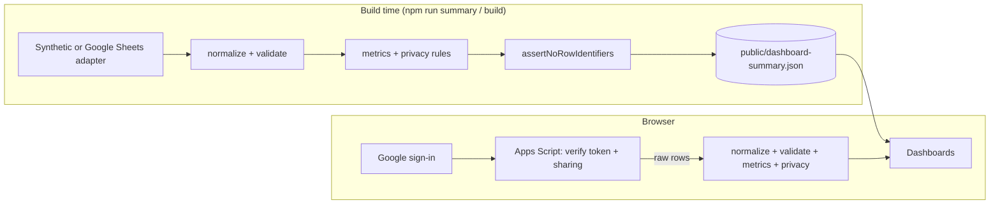

# Architecture overview

Community Event Analytics turns event spreadsheets into two dashboards. Data always goes through the same pipeline: **read → normalize → validate → calculate → apply privacy rules → render**. What changes between data modes is _where_ that pipeline runs and _what_ the browser receives.

## The two paths

|                  | Public modes (`synthetic`, `google-sheets`) | Private mode (`google-signin`)                                      |
| ---------------- | ------------------------------------------- | ------------------------------------------------------------------- |
| Pipeline runs    | Once, at build time                         | In the viewer's browser, on every page load                         |
| Browser receives | The summary file only                       | Raw sheet rows (authorized viewers only)                            |
| Access control   | None needed; nothing row-level is published | Apps Script verifies the sign-in token and the sheet's sharing list |
| Privacy rules    | Protect the published data                  | Keep charts readable; **not** an access boundary                    |

Both paths share the same normalization, metrics, and privacy code, so a chart means the same thing in every mode.

## Source folders

| Folder                          | Holds                                                                                             | Runs                                |
| ------------------------------- | ------------------------------------------------------------------------------------------------- | ----------------------------------- |
| `src/main.tsx`, `src/style.css` | React page shell and styles                                                                       | Browser                             |
| `src/dashboards/`               | One controller per tab; composes the features below                                               | Browser                             |
| `src/features/`                 | `auth/` (Google sign-in), `filters/` (filter state and bar), `feedback/` (board, themes, actions) | Browser                             |
| `src/summary/`                  | Summary contract, generation, scopes, and the browser `client.ts`                                 | Build; also browser in sign-in mode |
| `src/analytics/`                | Metrics, disclosure rules, sentiment scoring                                                      | Build; also browser in sign-in mode |
| `src/data/`                     | Adapters, normalization, validation, record types                                                 | Build; also browser in sign-in mode |
| `src/shared/`, `src/config.ts`  | Dependency-free helpers and community configuration                                               | Everywhere                          |

Imports flow one way, from the top of this table down, and `eslint.config.mjs` enforces it. Features do not import each other; a dashboard passes values between them. `src/summary/generate.ts` and the Google Sheets adapter are build-only, and lint fails if any browser module imports them.

## Pipeline stages

| Stage                   | Files                                                                                     | What it guarantees                                                                                                   |
| ----------------------- | ----------------------------------------------------------------------------------------- | -------------------------------------------------------------------------------------------------------------------- |
| **Adapter**             | `src/data/adapters/` (`synthetic.ts`, `google-sheets.ts`, `apps-script.ts`)               | Reads a source and returns raw rows. Knows nothing about metrics.                                                    |
| **Normalize**           | `src/data/normalize.ts`, with aliases in `src/config.ts`                                  | Source column names become canonical fields. Blanks become `null`, never `0`.                                        |
| **Validate**            | `src/data/validate.ts`                                                                    | Keys are unique and every row joins to a real event. Bad data raises a contract error instead of being dropped.      |
| **Assemble**            | `src/data/load.ts` → `loadData()`                                                         | Builds the row-level `DashboardData` used for calculation.                                                           |
| **Calculate**           | `src/analytics/metrics.ts`, `src/analytics/sentiment-score.ts`                            | Pure functions: rows in, numbers out.                                                                                |
| **Privacy + summary**   | `src/analytics/privacy.ts`, `src/summary/build.ts` → `buildSummary()`                     | Applies thresholds _before_ anything is serialized, and precomputes every filter selection (`src/summary/scope.ts`). |
| **Guard** (public only) | `assertNoRowIdentifiers()` in `src/summary/build.ts`, called by `src/summary/generate.ts` | Fails the build if a participant or response ID ends up in the summary.                                              |
| **Load** (browser)      | `src/summary/client.ts` → `loadSummary()`, or `src/summary/live.ts` → `loadLiveSummary()` | Fetches the published summary, or builds it live after sign-in.                                                      |
| **Render**              | `src/dashboards/`, using `src/features/filters/` and `src/features/feedback/`             | Looks up the current filter's precomputed scope and draws it with ECharts.                                           |

## Follow one number: the response rate

Here is the path of the **Response rate** figure on the Event effectiveness tab.

1. **Read.** The synthetic adapter (or Google Sheets) returns `events` rows with an attendance column and `surveyResponses` rows with a response ID.
2. **Normalize.** `normalizeSource()` maps each source's column names to the canonical `attended` and `response_id` fields. An empty attendance cell becomes `null`.
3. **Validate.** `validateSource()` checks that every survey response points to a real `event_id`.
4. **Calculate.** `kpisEffectiveness()` in `src/analytics/metrics.ts` divides the number of distinct `response_id`s by total known attendance. If attendance is missing or zero, the result is **`null`**, not 0%.
5. **Precompute.** `buildSummary()` runs that calculation for every reachable filter selection and stores the result as `kpis.responseRate` in each scope.
6. **Guard.** In the public modes, `generateSummary()` calls `assertNoRowIdentifiers()`, so no `response_id` can leave the build.
7. **Render.** When a viewer changes a filter, `scopeFor()` in `src/summary/client.ts` looks up the matching scope, and `src/dashboards/effectiveness.ts` shows the value with `fmtPct()`. A `null` appears as "–".

A new metric follows the same path: calculate it in `src/analytics/metrics.ts`, add it to the summary types and `buildSummary()`, then render it.

## Where to make common changes

| I want to…                           | Change                                                                     | Also update                                                                   |
| ------------------------------------ | -------------------------------------------------------------------------- | ----------------------------------------------------------------------------- |
| Rename labels, segments, or colors   | `src/config.ts`                                                            | [Configuration](configuration.md)                                             |
| Accept a new spreadsheet column name | Aliases in `src/config.ts`                                                 | `src/data/data.test.ts`                                                       |
| Add or change a metric               | `src/analytics/metrics.ts`, `src/summary/build.ts`, `src/summary/types.ts` | [Data contract](data-contract-v1.md); `SUMMARY_VERSION` if the format changes |
| Add a filter                         | `src/features/filters/filter-bar.ts`, **plus** `src/summary/scope.ts`      | `src/summary/summary.test.ts`                                                 |
| Change a chart or KPI card           | `src/dashboards/effectiveness.ts` or `src/dashboards/community.ts`         | Escape inserted text and tooltip HTML with `esc` from `src/shared/html.ts`    |
| Add a chart type or ECharts feature  | Register it in `src/dashboards/echarts.ts`                                 | Compare the changed charts against `main` in a browser                        |
| Add a data source                    | A new adapter in `src/data/adapters/`                                      | `src/summary/generate.ts`, `.env.example`, docs, deployment workflow          |

## Things that look odd but are intentional

- **React only wraps the page.** `src/main.tsx` handles sign-in and page state. The dashboards are plain DOM and ECharts controllers that release their charts and listeners through `dispose()`.
- **ECharts is imported piece by piece.** `src/dashboards/echarts.ts` registers only the chart types, components, and features the dashboards use, which keeps the bundle about a third smaller. A chart that needs something new must register it there first.
- **No arbitrary date ranges.** Public summaries can only answer the filter selections that were precomputed at build time.
- **`null` is everywhere.** Missing values stay unknown instead of becoming zero, because a false zero looks like real data.
- **Privacy runs before serialization, not in the charts.** Hiding a value in a chart does not protect it if the number is still in the published JSON.
- **Anonymity is not guaranteed.** Registration breakdowns across overlapping selections have a documented limitation; see the data contract's [conformance gaps](data-contract-v1.md#current-implementation-conformance-gaps).

## Further reading

- [Data contract v1](data-contract-v1.md): canonical fields, metric definitions, and privacy rules
- [Private dashboard with Google sign-in](google-signin.md): how the Apps Script access check works
- [Development tooling](development-tooling.md): commit and push hooks, linting, and formatting
- [AGENTS.md](../AGENTS.md): the detailed code map and rules for automated contributors
